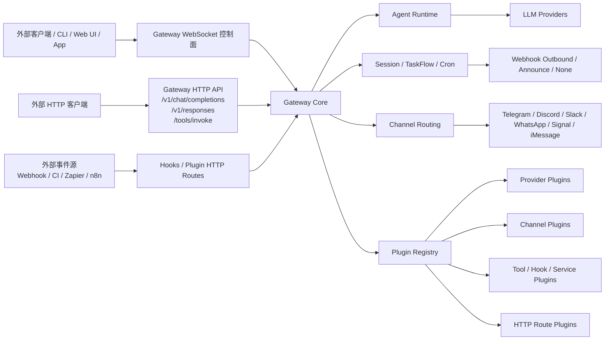
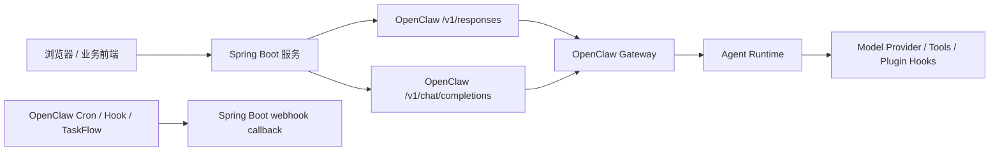
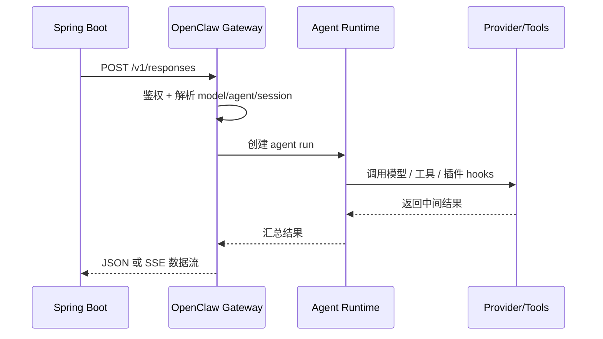
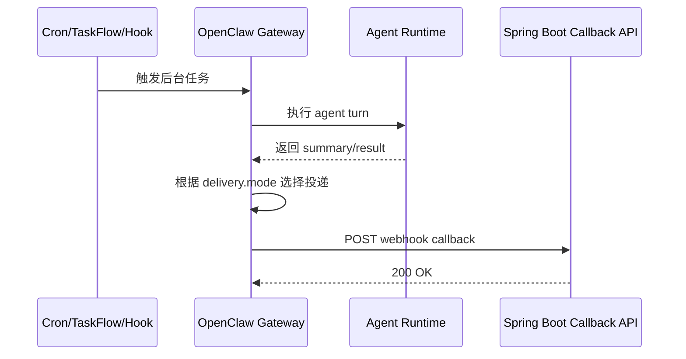

# OpenClaw 架构设计与功能解析学习笔记

## 1. OpenClaw 是什么

从源码和官方文档看，OpenClaw 的核心并不是单一聊天程序，而是一个统一的 AI Gateway 平台。它把控制面、消息路由、Agent 执行、插件扩展、自动化能力都收敛到一个 Gateway 进程里，再通过 WebSocket、HTTP、hooks、插件 HTTP route 等方式对外提供能力。

官方资料重点入口：

- Gateway Architecture: https://docs.openclaw.ai/concepts/architecture
- Gateway Protocol: https://docs.openclaw.ai/gateway/protocol
- Plugin Internals: https://docs.openclaw.ai/plugins/architecture
- Hooks: https://docs.openclaw.ai/automation/hooks
- Cron Jobs / Webhooks: https://docs.openclaw.ai/automation/cron-jobs
- OpenAI Chat Completions: https://docs.openclaw.ai/gateway/openai-http-api
- OpenResponses API: https://docs.openclaw.ai/gateway/openresponses-http-api
- Webhooks Plugin: https://docs.openclaw.ai/plugins/webhooks

## 2. OpenClaw 总体架构图



这张图对应 OpenClaw 的核心思路：

- Gateway 是统一入口
- Agent Runtime 是统一执行平面
- Plugin Registry 是统一扩展面
- Channels 是统一消息投递面
- Cron、Hooks、TaskFlow 是统一自动化面

## 3. 核心架构分层

### 3.1 Gateway 传输层

Gateway 是长生命周期进程，统一承载：

- WebSocket 控制协议
- HTTP 兼容接口
- Control UI
- hooks / webhook ingress
- 节点设备接入

官方文档明确说明 Gateway 使用一个复用端口，同时承载 WS 和 HTTP。源码里 `src/gateway/server-http.ts` 能看到 `/v1/chat/completions`、`/v1/responses`、`/tools/invoke` 等 HTTP 路径识别逻辑。

### 3.2 Agent 执行层

OpenClaw 的 `/v1/chat/completions` 和 `/v1/responses` 并不是独立推理服务，而是走正常 Gateway agent run 路径。也就是说，外部请求与 OpenClaw 内部 agent、工具、会话、权限模型是一致的。

### 3.3 Channels 消息层

OpenClaw 把 Telegram、Discord、Slack、Signal、iMessage、WhatsApp Web 等都纳入统一消息抽象。Core 负责：

- 消息工具 host
- 会话和线程绑定
- 路由与投递

而具体渠道能力由 channel plugin 负责。

### 3.4 Plugin 扩展层

插件可以注册多类能力：

- Provider
- Channel
- Tool
- Hook
- Service
- CLI
- HTTP Route

官方文档把插件系统拆成四层：

1. Manifest + discovery
2. Enablement + validation
3. Runtime loading
4. Surface consumption

这意味着 OpenClaw 不希望 core 里硬编码厂商和渠道行为，而是通过 registry 消费插件能力。

### 3.5 Automation 自动化层

自动化包括：

- internal hooks
- webhooks
- cron
- TaskFlow

这层不是旁路系统，而是和 agent/session 共用执行平面，因此外部事件、定时任务、消息到达都可以进入同一个执行模型。

## 4. Hook 机制详解

OpenClaw 里至少有三类 hook 概念。

### 4.1 Internal hooks

这是 Gateway 内部事件脚本机制。典型事件包括：

- `command:new`
- `command:reset`
- `command:stop`
- `session:compact:before`
- `session:compact:after`
- `session:patch`
- `gateway:startup`
- `message:received`
- `message:transcribed`
- `message:preprocessed`
- `message:sent`

源码 `src/hooks/internal-hook-types.ts` 显示它的基础结构是：

- `type`
- `action`
- `sessionKey`
- `context`
- `timestamp`
- `messages`

它更像平台生命周期和消息事件的回调机制。

### 4.2 Plugin hooks

这是更深层的 typed hooks，插件可以参与模型路由、prompt 生成、工具调用、消息发送、reply dispatch 等内部流程。

源码 `src/plugins/hook-types.ts` 列出了 28 个插件 hook，核心的包括：

- `before_model_resolve`
- `before_prompt_build`
- `before_agent_start`
- `before_agent_reply`
- `llm_input`
- `llm_output`
- `before_tool_call`
- `after_tool_call`
- `message_received`
- `message_sending`
- `message_sent`
- `reply_dispatch`
- `gateway_start`
- `gateway_stop`

其中最关键的几个：

- `before_model_resolve`: 改写模型和 provider 路由
- `before_prompt_build`: 注入或裁剪 prompt
- `before_tool_call`: 审计、阻断、审批工具调用
- `before_agent_reply`: 最终回复前短路或改写
- `message_sending`: 发往外部渠道前取消或修改
- `reply_dispatch`: 控制最终消息投递策略

这说明 OpenClaw 的 hook 不只是通知，而是参与控制决策链路。

### 4.3 HTTP hooks / Webhooks

这是给外部系统调用的自动化入口，不是内部事件回调。官方支持：

- `POST /hooks/wake`
- `POST /hooks/agent`
- `POST /hooks/<name>`

其中 `/hooks/agent` 在源码里并不是直接同步执行 agent，而是会被包装成一次 isolated cron/agent turn。这样做的好处是：

- 更容易隔离 session
- 支持 delivery 模式
- 支持 wake mode
- 更适合后台自动化任务

## 5. 插件系统详解

OpenClaw 的插件能力模型是 capability registration。典型能力包括：

- Text inference
- CLI backend
- Speech
- Realtime transcription / voice
- Media understanding
- Image / music / video generation
- Web fetch / web search
- Channel / messaging

官方也区分了几种插件形态：

- `plain-capability`
- `hybrid-capability`
- `hook-only`
- `non-capability`

常见注册方法：

- `registerProvider`
- `registerChannel`
- `registerTool`
- `registerHook`
- `registerSpeechProvider`
- `registerMediaUnderstandingProvider`
- `registerWebSearchProvider`
- `registerHttpRoute`
- `registerCommand`
- `registerService`

可以理解为：OpenClaw 在逐步从“基于历史 hook 的扩展”走向“基于显式能力注册的插件平台”。

## 6. Gateway 扩展功能

Gateway 的扩展能力主要有三类。

### 6.1 协议扩展

WebSocket 协议使用 TypeBox schema 定义，请求、响应、事件帧都有显式类型。这样 macOS app、CLI、Web UI、自动化客户端、节点设备都能共用同一套协议。

### 6.2 HTTP 兼容扩展

Gateway 内建 OpenAI / OpenResponses 兼容接口：

- `GET /v1/models`
- `GET /v1/models/{id}`
- `POST /v1/embeddings`
- `POST /v1/chat/completions`
- `POST /v1/responses`

其中 `/v1/responses` 是更推荐的新接口，适合 item-based input、client tools、流式事件。

### 6.3 Plugin HTTP Route 扩展

插件可以通过 `api.registerHttpRoute(...)` 把自己的 HTTP 路由挂到 Gateway HTTP server 下。

这里有一个很重要的设计边界：

- `auth: "gateway"`: 走 Gateway auth 和 runtime scope
- `auth: "plugin"`: 更适合插件自己做 webhook 验签，不自动继承 operator 高权限

也就是说，OpenClaw 的 HTTP 扩展不是随意开放的，而是有明确的权限边界。

## 7. Webhooks 插件

官方 bundled plugin `webhooks` 是插件化网关扩展的典型例子。

它的职责是：

- 暴露认证 HTTP route
- 把外部自动化系统接入 OpenClaw TaskFlow
- 让 Zapier、n8n、CI 或内部服务不写自定义插件也能驱动 TaskFlow

它支持的 action 包括：

- `create_flow`
- `get_flow`
- `list_flows`
- `find_latest_flow`
- `resolve_flow`
- `get_task_summary`
- `set_waiting`
- `resume_flow`
- `finish_flow`
- `fail_flow`
- `request_cancel`
- `cancel_flow`
- `run_task`

所以它不是简单的聊天 webhook，而是一个“外部系统驱动 OpenClaw 工作流状态机”的桥接层。

## 8. 外部服务如何请求 OpenClaw 并接受响应

### 8.1 推荐接口：`/v1/responses`

最适合新系统：

- 支持 item-based input
- 支持流式 SSE
- 更贴近 agent-native 能力模型

典型调用：

```bash
curl -X POST http://127.0.0.1:18789/v1/responses \
  -H "Authorization: Bearer YOUR_GATEWAY_TOKEN" \
  -H "Content-Type: application/json" \
  -d '{
    "model": "openclaw/default",
    "input": "请总结今天的告警",
    "stream": false
  }'
```

### 8.2 兼容接口：`/v1/chat/completions`

适合老生态客户端，如 Open WebUI、LobeChat、LibreChat。

```bash
curl -X POST http://127.0.0.1:18789/v1/chat/completions \
  -H "Authorization: Bearer YOUR_GATEWAY_TOKEN" \
  -H "Content-Type: application/json" \
  -d '{
    "model": "openclaw/default",
    "messages": [
      {"role": "user", "content": "请分析最近工单"}
    ]
  }'
```

### 8.3 深度集成：Gateway WebSocket Protocol

如果你需要：

- 持续连接
- 事件订阅
- 控制面方法调用
- node/device 能力接入

就直接接入 Gateway WS 协议。

## 9. OpenClaw 配置映射与官方文档入口

这里有一个很容易混淆的点：Spring Boot 示例项目中的 `application.yml` 配置，不等于 OpenClaw 服务端自己的原生配置。

例如，Java 示例项目里写的是：

```yaml
openclaw:
  base-url: http://127.0.0.1:18789
  token: YOUR_GATEWAY_TOKEN
  callback-token: MY_CRON_WEBHOOK_TOKEN
```

这段配置是“调用方配置”，用于让 Spring Boot 知道：

- 去请求哪个 OpenClaw Gateway
- 访问 `/v1/*` 时带什么 Bearer Token
- 接收 OpenClaw webhook 回调时校验什么 Token

而在 OpenClaw 侧，真正对应的是下面这些原生配置：

| Spring Boot 示例配置 | OpenClaw 原生配置 | 说明 |
|---|---|---|
| `openclaw.base-url` | `gateway.bind` + `gateway.port` | 组合起来决定 OpenClaw 实际监听地址 |
| `openclaw.token` | `gateway.auth.mode = "token"` + `gateway.auth.token` | Gateway HTTP API 的访问鉴权 |
| `openclaw.callback-token` | `cron.webhookToken` | OpenClaw 通过 cron webhook 回调外部系统时使用 |
| 外部系统调用 `/hooks/*` 时的 token | `hooks.token` | 用于 `/hooks/wake`、`/hooks/agent` 等入口 |

也就是说：

- `application.yml` 里的 `openclaw.*` 是 Java 项目自己的配置
- OpenClaw 服务端真正读取的是 `gateway.*`、`cron.*`、`hooks.*`

### 9.1 如何开启 `POST /v1/chat/completions`

OpenClaw Gateway 可以提供一个小型的 OpenAI 兼容 Chat Completions 端点，但这个端点默认是禁用的。

要启用它，需要在 OpenClaw 配置里显式打开：

```json5
{
  gateway: {
    auth: {
      mode: "token",
      token: "YOUR_GATEWAY_TOKEN"
    },
    http: {
      endpoints: {
        chatCompletions: {
          enabled: true
        }
      }
    }
  }
}
```

启用后即可请求：

- `POST /v1/chat/completions`

如果你还想同时启用更推荐的 `/v1/responses`，可以一起配置：

```json5
{
  gateway: {
    auth: {
      mode: "token",
      token: "YOUR_GATEWAY_TOKEN"
    },
    http: {
      endpoints: {
        chatCompletions: {
          enabled: true
        },
        responses: {
          enabled: true
        }
      }
    }
  }
}
```

### 9.2 最小可运行配置示例

如果你希望同时覆盖“Spring Boot 调用 + webhook 回调 + hooks 触发 + Chat Completions”，可以按下面思路准备 OpenClaw 配置：

```json5
{
  gateway: {
    mode: "local",
    bind: "loopback",
    port: 18789,
    auth: {
      mode: "token",
      token: "YOUR_GATEWAY_TOKEN"
    },
    http: {
      endpoints: {
        chatCompletions: {
          enabled: true
        },
        responses: {
          enabled: true
        }
      }
    }
  },
  cron: {
    webhookToken: "MY_CRON_WEBHOOK_TOKEN"
  },
  hooks: {
    enabled: true,
    token: "MY_HOOK_TOKEN",
    path: "/hooks"
  }
}
```

### 9.3 官方文档入口

这部分配置最值得看的官方文档是：

- [Gateway 总入口](https://docs.openclaw.ai/gateway/index)
- [Gateway 配置说明](https://docs.openclaw.ai/gateway/configuration)
- [配置项参考](https://docs.openclaw.ai/gateway/configuration-reference)
- [OpenAI Chat Completions 接口](https://docs.openclaw.ai/gateway/openai-http-api)
- [OpenResponses 接口](https://docs.openclaw.ai/gateway/openresponses-http-api)

阅读建议：

1. 先看 Gateway 总入口，理解 OpenClaw Gateway 的角色
2. 再看 OpenAI Chat Completions 和 OpenResponses 两个 HTTP 接口文档
3. 最后用 Configuration 与 Configuration Reference 查具体配置项

## 10. Spring Boot 调 OpenClaw + 接收 OpenClaw 回调

### 10.1 集成架构图



说明：

- Spring Boot 作为业务系统调用 OpenClaw 获取 AI 结果
- OpenClaw 作为自动化执行引擎，在任务结束后回调 Spring Boot
- 两边通过不同 token 分离鉴权

### 10.2 Spring Boot 请求 OpenClaw 时序图



### 10.3 OpenClaw 主动回调 Spring Boot 时序图



### 10.4 推荐的落地方式

- Spring Boot 同步获取 AI 结果时，优先使用 `/v1/responses`
- Spring Boot 如果需要兼容老客户端协议，可用 `/v1/chat/completions`
- OpenClaw 主动推送外部系统时，优先使用 cron 的 `delivery.mode = webhook`
- 更复杂的外部工作流编排再引入 `webhooks` 插件和 TaskFlow

## 11. OpenClaw 如何主动调用外部服务推送数据

官方内建方案是 cron 的 webhook delivery。

delivery mode 包括：

- `announce`: 发送到渠道
- `webhook`: POST 到外部 URL
- `none`: 仅内部处理

相关配置重点：

- `cron.webhookToken`: 作为 Bearer Token 附加到 webhook 请求头
- job `delivery.mode = "webhook"`
- job `delivery.to = "https://your-service/callback"`

这非常适合：

- 定时日报
- 完成回调
- 告警汇总后推送
- 与工单系统、CI 或自建平台集成

## 12. 学习和实践建议

对于企业系统集成，推荐的第一阶段组合是：

- 同步问答：`/v1/responses`
- 外部事件触发 OpenClaw：`/hooks/agent`
- OpenClaw 主动推送外部系统：`cron delivery.mode = webhook`
- 复杂流程：以后再引入 `webhooks` 插件 + TaskFlow

这样复杂度最低，但未来扩展路径非常完整。
