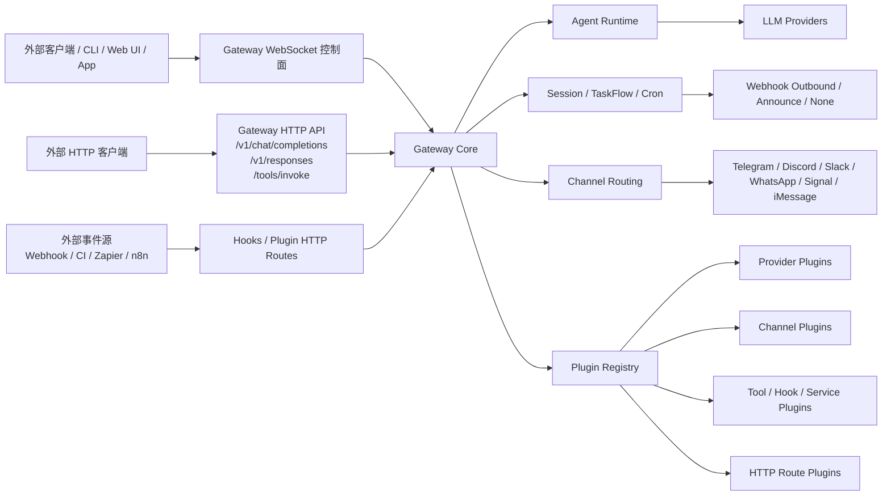
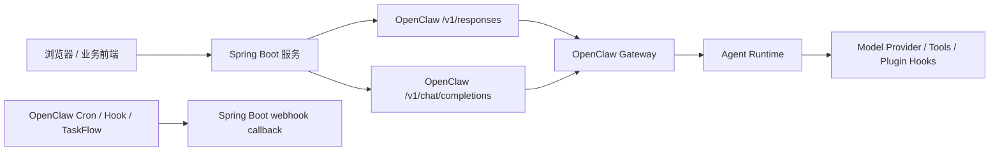
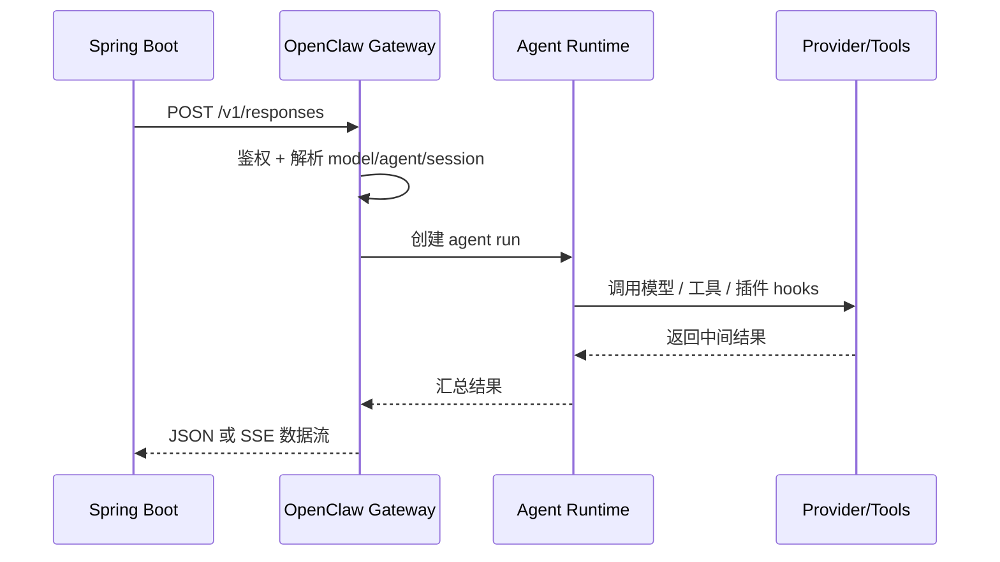
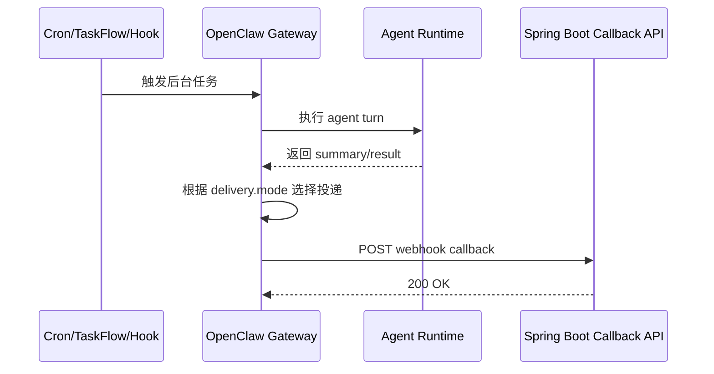

# OpenClaw 团队知识库

## 目录

1. 文档目标
1.1 快速索引
1.2 新同学上手路线
2. OpenClaw 是什么
3. 总体架构
4. 核心模块分层
5. Hook 机制
6. 插件机制
7. Gateway 扩展能力
8. Webhooks 插件
9. 外部系统如何请求 OpenClaw
10. OpenClaw 如何主动推送外部系统
11. Spring Boot 集成方案
12. Java WebClient + SSE 方案
13. 配置映射与官方文档入口
14. 项目示例说明
15. 环境与构建注意事项
16. 术语表
17. FAQ
18. 后续维护建议

---

## 1. 文档目标

这份文档作为团队内部的 OpenClaw 学习与实践知识库，用于统一以下内容：

- OpenClaw 架构认知
- Hook、Plugin、Gateway 扩展机制理解
- Java / Spring Boot 集成方案
- 流式 SSE 接入思路
- 外部回调与自动化方案
- 常见问题与团队落地建议

这份文档适合作为后续持续维护的主文档。

---

## 1.1 快速索引

如果你只想快速定位某一类问题，可以直接按下面跳转阅读：

- 想先搞清楚 OpenClaw 是什么、整体长什么样：看“2. OpenClaw 是什么”和“3. 总体架构”
- 想理解内部是怎么分层的：看“4. 核心模块分层”
- 想重点看 hook：看“5. Hook 机制”
- 想重点看插件和扩展点：看“6. 插件机制”和“7. Gateway 扩展能力”
- 想看 `webhooks` 插件和 TaskFlow：看“8. Webhooks 插件”以及 `docs/webhooks-taskflow-guide.md`
- 想先分清 `hook`、`hooks`、`webhook`、`webhooks` 插件这些词：看 `docs/openclaw-terminology-guide.md`
- 想知道外部系统如何请求 OpenClaw：看“9. 外部系统如何请求 OpenClaw”
- 想知道 OpenClaw 如何主动推送外部系统：看“10. OpenClaw 如何主动推送外部系统”
- 想看 Spring Boot 集成图和时序图：看“11. Spring Boot 集成方案”
- 想看 Java SSE：看“12. Java WebClient + SSE 方案”
- 想看配置怎么对上官方：看“13. 配置映射与官方文档入口”以及 `docs/openclaw-config-guide.md`
- 想看项目怎么落地：看“14. 项目示例说明”
- 想快速排查常见问题：看“17. FAQ”

---

## 1.2 新同学上手路线

如果是第一次接触这个项目，建议按下面顺序看：

1. 先看“2. OpenClaw 是什么”，建立整体概念
2. 再看“3. 总体架构”和“4. 核心模块分层”，建立模块地图
3. 然后看“9. 外部系统如何请求 OpenClaw”和“10. OpenClaw 如何主动推送外部系统”，理解最常见集成方式
4. 接着看“11. Spring Boot 集成方案”和“12. Java WebClient + SSE 方案”，对照项目代码理解落地方式
5. 最后看“13. 配置映射与官方文档入口”与 `docs/openclaw-config-guide.md`，掌握配置和官方资料入口

如果你的工作重点不同，也可以按角色来读：

- 后端开发：优先看 9、10、11、12、13
- 平台/架构同学：优先看 2、3、4、5、6、7
- 自动化/流程编排同学：优先看 8、10，以及 `docs/webhooks-taskflow-guide.md`

---

## 2. OpenClaw 是什么

OpenClaw 不是单纯的聊天机器人程序，而是一个统一的 AI Gateway 平台。

它把以下能力统一到同一个 Gateway 进程中：

- WebSocket 控制面
- OpenAI / OpenResponses 兼容 HTTP 接口
- Agent 执行
- 多渠道消息路由
- 插件扩展
- hooks / webhooks
- cron / TaskFlow 自动化

可以把它理解为一个：

- AI control plane
- agent runtime host
- messaging runtime
- automation platform
- plugin host

---

## 3. 总体架构



这张图反映了 OpenClaw 的关键设计：

- Gateway 是统一入口
- Agent Runtime 是统一执行平面
- Plugin Registry 是统一扩展平面
- Channel Routing 是统一消息投递平面
- Session / TaskFlow / Cron 是统一自动化平面

---

## 4. 核心模块分层

### 4.1 Gateway 传输层

Gateway 是长生命周期进程，统一承载：

- WebSocket 控制协议
- HTTP 兼容接口
- hooks / webhook ingress
- Control UI
- node / device 接入

核心特点：

- 单端口复用
- 控制面与运行面统一
- 所有客户端都接到同一核心进程

### 4.2 Agent 执行层

`/v1/chat/completions` 和 `/v1/responses` 在 OpenClaw 中并不是独立模型服务，而是走正常 Gateway agent run 路径。

这意味着：

- session 机制参与执行
- tools 会参与执行
- hooks 会参与执行
- plugins 会参与执行
- 权限与策略也是统一的

### 4.3 Channels 消息层

OpenClaw 统一抽象多种消息渠道：

- Telegram
- Discord
- Slack
- Signal
- iMessage
- WhatsApp Web
- 其他扩展渠道

Core 负责：

- 消息工具 host
- session / thread 绑定
- 通用路由

Channel plugin 负责：

- 各渠道自己的行为实现
- 各渠道自己的能力适配

### 4.4 Plugin 扩展层

插件可以提供：

- provider
- channel
- tool
- hook
- service
- CLI command
- HTTP route

插件在 OpenClaw 中不是附属脚本，而是正式的平台能力提供者。

### 4.5 Automation 自动化层

自动化包括：

- internal hooks
- HTTP hooks / webhooks
- cron
- TaskFlow

重要理解：

OpenClaw 的自动化不是外挂系统，而是复用同一个 agent 与 session 执行平面。

---

## 5. Hook 机制

OpenClaw 中至少有三类 hook 概念。

### 5.1 Internal hooks

这是 Gateway 内部事件脚本机制。

典型事件：

- `command:new`
- `command:reset`
- `command:stop`
- `session:compact:before`
- `session:compact:after`
- `session:patch`
- `gateway:startup`
- `message:received`
- `message:transcribed`
- `message:preprocessed`
- `message:sent`

它更像平台生命周期回调。

### 5.2 Plugin hooks

这是插件层更深的 typed hooks，参与执行链路控制。

典型 hooks：

- `before_model_resolve`
- `before_prompt_build`
- `before_agent_start`
- `before_agent_reply`
- `llm_input`
- `llm_output`
- `before_tool_call`
- `after_tool_call`
- `message_received`
- `message_sending`
- `message_sent`
- `reply_dispatch`
- `gateway_start`
- `gateway_stop`

它们可用于：

- 模型和 provider 改写
- prompt 注入或裁剪
- 工具调用审批、阻断
- 回复前改写
- 渠道发送前拦截
- 控制最终消息投递策略

### 5.3 HTTP hooks / webhooks

这是给外部系统调用的自动化入口。

常见接口：

- `POST /hooks/wake`
- `POST /hooks/agent`
- `POST /hooks/<name>`

其中 `/hooks/agent` 更适合后台异步任务触发，不是单纯同步聊天接口。

---

## 6. 插件机制

### 6.1 插件系统目标

OpenClaw 通过插件系统尽量避免在 core 里硬编码具体厂商、具体渠道和特定特殊逻辑，而是通过 registry 统一暴露能力。

### 6.2 常见注册能力

- `registerProvider`
- `registerChannel`
- `registerTool`
- `registerHook`
- `registerSpeechProvider`
- `registerMediaUnderstandingProvider`
- `registerWebSearchProvider`
- `registerHttpRoute`
- `registerCommand`
- `registerService`

### 6.3 插件形态

常见插件形态：

- `plain-capability`
- `hybrid-capability`
- `hook-only`
- `non-capability`

---

## 7. Gateway 扩展能力

### 7.1 协议扩展

Gateway 协议是显式建模的，适合：

- CLI
- Web UI
- App
- automation client
- node / device

### 7.2 HTTP 兼容扩展

Gateway 内建：

- `GET /v1/models`
- `GET /v1/models/{id}`
- `POST /v1/embeddings`
- `POST /v1/chat/completions`
- `POST /v1/responses`

推荐优先使用 `/v1/responses`。

### 7.3 Plugin HTTP Route 扩展

插件可以注册自己的 HTTP 路由。

权限分界：

- `auth: "gateway"`
- `auth: "plugin"`

这决定了 route 是走 Gateway 权限体系，还是插件自己做安全控制。

---

## 8. Webhooks 插件

官方 `webhooks` 插件适用于：

- Zapier
- n8n
- CI
- 内部调度系统
- 外部工作流系统

它不是普通聊天接口，而是让外部系统可以驱动 OpenClaw TaskFlow。

典型动作：

- `create_flow`
- `get_flow`
- `list_flows`
- `find_latest_flow`
- `resolve_flow`
- `get_task_summary`
- `set_waiting`
- `resume_flow`
- `finish_flow`
- `fail_flow`
- `request_cancel`
- `cancel_flow`
- `run_task`

### 8.1 `hooks`、`webhooks` 插件、callback webhook 的区别

这三个概念很容易混淆，建议按“谁先发起请求”来理解。

| 概念 | 谁发起 | 典型路径 | 主要作用 | 适合场景 |
| --- | --- | --- | --- | --- |
| `hooks` | 外部系统发起到 OpenClaw | `/hooks/wake`、`/hooks/agent`、`/hooks/<name>` | 触发一次 wake、agent turn 或通用事件 | 外部系统临时触发 OpenClaw 执行一次动作 |
| `webhooks` 插件 | 外部系统发起到 OpenClaw | `/plugins/webhooks/<route>` | 通过插件 route 驱动 TaskFlow 动作 | 外部系统编排有状态流程 |
| callback webhook | OpenClaw 发起到外部系统 | 你的业务回调地址 | OpenClaw 把任务结果主动推送给外部系统 | cron 回调、异步任务完成通知 |

团队可以这样记：

- `hooks`：外部系统通知 OpenClaw“做一次事”
- `webhooks` 插件：外部系统通过插件 route 精细驱动 TaskFlow
- callback webhook：OpenClaw 执行完后，反过来通知你的系统

### 8.2 callback webhook 是谁触发的

如果说的是项目中的 `POST /api/webhook/openclaw/callback`，触发者是 OpenClaw Gateway，更准确地说，是 OpenClaw 的 cron / job delivery 机制。

也就是说：

- OpenClaw 中某个任务执行完成
- 它的 `delivery.mode = "webhook"`
- Gateway 就会主动向你的业务回调地址发起 `POST`

### 8.3 OpenClaw 怎么配置 callback webhook

callback webhook 不是通过 `webhooks` 插件配置出来的，而是通过 cron / job delivery 配置出来的。

通常需要两层配置：

```json5
{
  cron: {
    webhookToken: "MY_CRON_WEBHOOK_TOKEN"
  }
}
```

以及任务自身的 delivery 配置：

```json5
{
  delivery: {
    mode: "webhook",
    to: "http://127.0.0.1:8080/api/webhook/openclaw/callback"
  }
}
```

可以这样理解：

- `cron.webhookToken` 决定 OpenClaw 回调时带什么 Bearer Token
- `delivery.mode = "webhook"` 决定任务完成后是否主动回调
- `delivery.to` 决定回调到哪个 URL

### 8.4 `hooks` 和 `webhooks` 插件在配置上的区别

`hooks` 是 Gateway 自带的通用 HTTP 入口，常见配置是：

```json5
{
  hooks: {
    enabled: true,
    token: "MY_HOOK_TOKEN",
    path: "/hooks"
  }
}
```

`webhooks` 插件则是插件级 route，常见配置是：

```json5
{
  plugins: {
    entries: {
      webhooks: {
        enabled: true,
        config: {
          routes: {
            zapier: {
              path: "/plugins/webhooks/zapier",
              sessionKey: "agent:main:main",
              controllerId: "webhooks/zapier",
              secret: {
                source: "inline",
                value: "YOUR_WEBHOOK_PLUGIN_SECRET"
              }
            }
          }
        }
      }
    }
  }
}
```

因此：

- `hooks` 更像 Gateway 的通用外部入口
- `webhooks` 插件更像 TaskFlow 的插件化桥接入口

---

## 9. 外部系统如何请求 OpenClaw

### 9.1 推荐：`/v1/responses`

适合新系统，优点：

- 支持 item-based input
- 支持 SSE
- 更接近 agent-native 能力

适用场景：

- Java 后端
- 企业中台
- 工作流平台
- 需要逐步扩展 tool / file / image 输入的系统

### 9.2 兼容：`/v1/chat/completions`

适合老 OpenAI 兼容客户端。

### 9.3 深度控制：WebSocket Gateway Protocol

适合：

- 长连接
- 事件订阅
- 控制面功能
- 节点能力接入

---

## 10. OpenClaw 如何主动推送外部系统

官方内建方案是 cron 的 webhook delivery。

delivery mode：

- `announce`
- `webhook`
- `none`

其中 `webhook` 适合：

- 定时日报
- 完成回调
- 异步任务结果通知
- 与工单系统、CI、自建服务联动

---

## 11. Spring Boot 集成方案

### 11.1 集成架构图



### 11.2 Spring Boot 请求 OpenClaw 时序图



### 11.3 OpenClaw 回调 Spring Boot 时序图



### 11.4 推荐落地方式

- 同步结果获取：优先 `/v1/responses`
- 老协议兼容：`/v1/chat/completions`
- OpenClaw 主动推送：cron webhook
- 复杂流程：`webhooks` 插件 + TaskFlow

---

## 12. Java WebClient + SSE 方案

### 12.1 基本思路

使用：

- Spring WebFlux
- `WebClient`
- `Flux<String>`

来接收 OpenClaw `/v1/responses` 的 SSE 数据流。

### 12.2 实现分层建议

建议分成两层：

1. 原始 SSE 接收层
2. 文本提取层

这样更适合调试和演进。

### 12.3 为什么要同时保留 raw 和 text

- raw SSE：便于理解 OpenClaw 实际事件结构
- text SSE：便于前端直接展示

### 12.4 文本提取策略

为了兼容不同事件形态，示例里采用防御式提取：

- `delta`
- `output_text`
- `text`
- `response.output`
- `content`
- `item.content`

---

## 13. 配置映射与官方文档入口

为了避免把“Spring Boot 示例配置”和“OpenClaw 原生配置”混在一起，建议团队统一按两层理解：

- `application.yml` 里的 `openclaw.*` 是 Java 客户端配置
- OpenClaw 自己的 `gateway.*`、`cron.*`、`hooks.*` 才是服务端配置

最常见的对应关系如下：

| Java 示例配置 | OpenClaw 原生配置 | 说明 |
|---|---|---|
| `openclaw.base-url` | `gateway.bind` + `gateway.port` | 决定 Spring Boot 调谁 |
| `openclaw.token` | `gateway.auth.mode = "token"` + `gateway.auth.token` | 决定 Spring Boot 如何访问 `/v1/*` |
| `openclaw.callback-token` | `cron.webhookToken` | 决定 OpenClaw 主动 webhook 回调时带什么 Bearer Token |
| 外部调用 hooks 时的 token | `hooks.token` | 决定谁可以调 `/hooks/wake`、`/hooks/agent` |

如果要开启 OpenAI 兼容的 Chat Completions 端点，需要在 OpenClaw 配置里显式打开：

```json5
{
  gateway: {
    auth: {
      mode: "token",
      token: "YOUR_GATEWAY_TOKEN"
    },
    http: {
      endpoints: {
        chatCompletions: {
          enabled: true
        }
      }
    }
  }
}
```

对应的接口为：

- `POST /v1/chat/completions`

更完整的配置对照、最小 `openclaw.json` 示例和官方文档链接，建议直接看：

- `docs/openclaw-config-guide.md`

推荐官方文档入口：

- [Gateway 总入口](https://docs.openclaw.ai/gateway/index)
- [Gateway 配置说明](https://docs.openclaw.ai/gateway/configuration)
- [配置项参考](https://docs.openclaw.ai/gateway/configuration-reference)
- [OpenAI Chat Completions 接口](https://docs.openclaw.ai/gateway/openai-http-api)
- [OpenResponses 接口](https://docs.openclaw.ai/gateway/openresponses-http-api)

---

## 14. 项目示例说明

项目位置：

- `D:\spring_AI\openclaw_spring`

主要内容：

- Maven 工程
- Spring Boot 基础配置
- OpenClaw `/v1/responses` 调用
- raw SSE 转发
- text SSE 提取
- webhook callback 接收
- README
- 学习文档

建议阅读顺序：

1. `README.md`
2. `docs/openclaw-study.md`
3. 本文档
4. Java 源码

---

## 15. 环境与构建注意事项

### 14.1 Spring Boot 版本要求

当前项目使用 Spring Boot 3.3.2，需要 Java 17+。

### 14.2 已发现的问题

本次在本机验证时发现：

- `java -version` 是较新版本
- 但 `mvn -version` 实际绑定的是 Java 8 JRE

因此 Maven 构建失败的根因不是项目源码，而是 Maven 使用了错误的 Java 运行时。

### 14.3 建议

确保 Maven 也切换到 JDK 17+ 后再运行：

- `mvn spring-boot:run`
- `mvn package`

---

## 16. 术语表

### Gateway

OpenClaw 核心进程，统一承载 WS、HTTP、自动化、控制面。

### Agent Runtime

实际执行模型推理、工具调用、session 操作的运行层。

### Channel Plugin

负责某一消息渠道集成的插件。

### Provider Plugin

负责某一模型或能力提供商接入的插件。

### Hook

对生命周期、消息、工具调用、prompt 构建等流程进行拦截或扩展的机制。

### TaskFlow

OpenClaw 中用于编排任务状态流转的自动化机制。

### Cron Delivery

OpenClaw cron 任务结束后的投递方式，可为 announce、webhook 或 none。

### SSE

Server-Sent Events，服务端单向流式事件输出方式，适用于流式文本返回。

---

## 17. FAQ

### Q1：新系统应该优先接哪个接口？

优先 `/v1/responses`。

### Q2：什么时候用 `/v1/chat/completions`？

当你已经有现成 OpenAI Chat Completions 客户端或兼容逻辑时。

### Q3：OpenClaw 能不能主动推送结果到外部系统？

可以，推荐使用 cron 的 `delivery.mode = webhook`。

### Q4：`/hooks/agent` 和 `/v1/responses` 有什么区别？

- `/v1/responses` 更适合请求-响应式 AI 调用
- `/hooks/agent` 更适合外部事件触发后台任务

### Q5：是否一开始就需要上 `webhooks` 插件？

不需要。先用 `/v1/responses` + cron webhook 通常就够了。复杂流程再上 TaskFlow。

### Q6：为什么示例项目用了 WebFlux？

因为 `WebClient` 和 SSE 流式处理更适合使用 `Flux`。

### Q7：`openclaw.token` 是不是 OpenClaw 官方配置项？
不是。它是 Java 示例项目里的客户端配置，对应 OpenClaw 服务端的 `gateway.auth.token`。

### Q8：`openclaw.callback-token` 在 OpenClaw 里应该配哪里？
它在 OpenClaw 侧对应的是 `cron.webhookToken`，用于 cron webhook delivery 的 Bearer Token。

### Q9：如何开启 `POST /v1/chat/completions`？
在 OpenClaw 配置中设置 `gateway.http.endpoints.chatCompletions.enabled = true`。

### Q10：callback webhook、`hooks`、`webhooks` 插件分别是什么？

- callback webhook：OpenClaw 主动回调你的系统
- `hooks`：外部系统调用 Gateway 的通用 HTTP 入口
- `webhooks` 插件：外部系统通过插件 route 驱动 TaskFlow

---

## 18. 后续维护建议

建议把这份文档作为团队主知识库文档，后续追加：

- 统一配置模板
- DTO 版本 Java SDK
- 前端消费 SSE 示例
- 回调安全策略
- TaskFlow 实际案例
- 部署方案
- FAQ 扩展

同时保留以下文档作为补充资料：

- `openclaw-study.md`：偏架构分析与图示
- `team-learning-notes-2026-04-14.md`：偏本次交流沉淀
