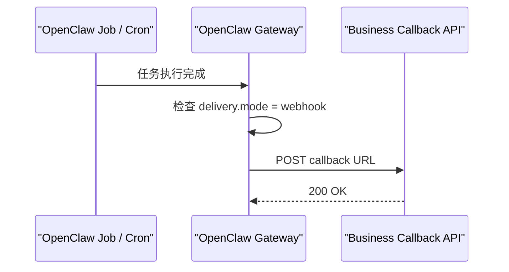

# OpenClaw 术语对照表

这份文档用于统一团队在讨论 OpenClaw 时最容易混淆的几个词，尤其是：

- `hook`
- `hooks`
- `webhook`
- `webhooks` 插件
- callback webhook
- TaskFlow
- cron delivery

建议把它当成“名词速查页”来用。

---

## 0. 官方文档怎么对上

如果你已经分不清“这个词到底该去哪个官方页面看”，先看下面这张表。

| 术语 / 主题 | 官方文档地址 | 更准确的定位 |
| --- | --- | --- |
| hooks | `https://docs.openclaw.ai/automation/hooks` | 官方 hooks 页面，重点是 internal hooks、plugin hooks 和 hooks 自动化 |
| `webhooks` 插件 | `https://docs.openclaw.ai/plugins/webhooks` | 官方插件页面，重点是插件 route 和 TaskFlow 桥接 |
| callback webhook / cron webhook delivery | `https://docs.openclaw.ai/gateway/configuration-reference` | 更适合查 `cron.webhookToken`、delivery 相关配置 |
| `POST /v1/chat/completions` | `https://docs.openclaw.ai/gateway/openai-http-api` | 官方 OpenAI 兼容接口说明 |
| `POST /v1/responses` | `https://docs.openclaw.ai/gateway/openresponses-http-api` | 官方 OpenResponses 接口说明 |
| Gateway 配置总览 | `https://docs.openclaw.ai/gateway/configuration` | 先理解整体配置思路 |

这里最容易搞混的是：

- `https://docs.openclaw.ai/automation/hooks` 对应的是 hooks 机制官方文档
- `https://docs.openclaw.ai/plugins/webhooks` 对应的是 `webhooks` 插件官方文档
- 两者不是同一件事

---

## 1. 一张表先看懂

| 术语 | 是什么 | 谁发起 | 典型路径 / 配置 | 主要作用 |
| --- | --- | --- | --- | --- |
| `hook` | 广义上的钩子机制 | 不固定 | internal hook / plugin hook | 在执行链路中拦截、注入、改写 |
| internal hooks | Gateway 内部事件脚本钩子 | OpenClaw 内部事件触发 | `hooks.internal.entries` | 响应 session、message、gateway 生命周期事件 |
| plugin hooks | 插件级 typed hooks | OpenClaw 执行链路触发 | 插件注册 `registerHook` | 参与模型解析、prompt、工具调用、回复分发 |
| `hooks` | Gateway 暴露给外部系统的通用 HTTP 入口 | 外部系统 -> OpenClaw | `/hooks/wake`、`/hooks/agent`、`/hooks/<name>` | 触发一次 wake、agent turn 或外部事件 |
| `webhook` | 泛指 HTTP 回调/通知方式 | 视上下文而定 | 不固定 | 用 HTTP 把事件推给另一方 |
| callback webhook | OpenClaw 主动回调你的系统 | OpenClaw -> 外部系统 | `delivery.mode = "webhook"`、`delivery.to`、`cron.webhookToken` | 把任务结果主动推送到业务系统 |
| `webhooks` 插件 | OpenClaw 的插件级 HTTP route 能力 | 外部系统 -> OpenClaw | `/plugins/webhooks/<route>` | 把外部请求桥接到 TaskFlow |
| TaskFlow | OpenClaw 的任务流状态机 | 通常由插件、自动化或外部请求驱动 | `create_flow`、`run_task` 等动作 | 管理流程状态、子任务、恢复、完成、失败 |
| cron delivery | OpenClaw cron 任务完成后的投递机制 | OpenClaw 内部触发 | `announce` / `webhook` / `none` | 决定任务结果发到哪里 |

---

## 2. `hook` 和 `hooks` 不是一回事

这两个词经常被混用，但它们不是同一个概念。

### 2.1 `hook`

`hook` 是一个通用词，表示“钩子机制”。

在 OpenClaw 里常见的 `hook` 包括：

- internal hooks
- plugin hooks

它们的共同点是：

- 都是执行链路中的拦截点
- 都更偏平台内部扩展机制

### 2.2 `hooks`

`hooks` 是 OpenClaw Gateway 对外暴露的一组 HTTP 入口。

常见路径：

- `POST /hooks/wake`
- `POST /hooks/agent`
- `POST /hooks/<name>`

它的特点是：

- 外部系统主动调用 OpenClaw
- 更适合触发一次 wake 或 agent turn
- 更像通用外部事件入口

---

## 3. `webhook` 和 `webhooks` 插件也不是一回事

### 3.1 `webhook`

`webhook` 本身是一个通用名词，泛指 HTTP 回调通知机制。

在本项目语境里，最常见的是 callback webhook，也就是：

- OpenClaw 执行完任务后
- 主动向你的 Spring Boot 服务发起 `POST`

这类配置重点通常是：

```json5
{
  cron: {
    webhookToken: "MY_CRON_WEBHOOK_TOKEN"
  }
}
```

以及任务上的：

```json5
{
  delivery: {
    mode: "webhook",
    to: "http://127.0.0.1:8080/api/webhook/openclaw/callback"
  }
}
```

### 3.2 `webhooks` 插件

`webhooks` 插件是 OpenClaw 的官方插件之一。

它的特点是：

- 对外暴露插件级 HTTP route
- 用共享密钥保护 route
- 把外部系统的请求转成 TaskFlow 动作

常见配置示意：

```json5
{
  plugins: {
    entries: {
      webhooks: {
        enabled: true,
        config: {
          routes: {
            zapier: {
              path: "/plugins/webhooks/zapier",
              sessionKey: "agent:main:main",
              controllerId: "webhooks/zapier",
              secret: {
                source: "inline",
                value: "YOUR_WEBHOOK_PLUGIN_SECRET"
              }
            }
          }
        }
      }
    }
  }
}
```

也就是说：

- `webhook` 是一种 HTTP 通知方式
- `webhooks` 插件是 OpenClaw 中一个具体的插件能力

---

## 4. callback webhook 到底是谁触发的

如果说的是项目中的：

- `POST /api/webhook/openclaw/callback`

那么触发者是：

- OpenClaw Gateway
- 更准确地说，是 OpenClaw 的 cron / job delivery 机制

完整方向是：



因此：

- callback webhook 不是你的系统调出去的
- 也不是 `webhooks` 插件调出来的
- 而是 OpenClaw 在任务结束后主动发起的

---

## 5. `hooks`、`webhooks` 插件、callback webhook 怎么选

如果你只是想让外部系统“触发一次 OpenClaw 执行”：

- 选 `hooks`

如果你想让外部系统“驱动有状态流程”：

- 选 `webhooks` 插件 + TaskFlow

如果你想让 OpenClaw“执行完后主动通知你的系统”：

- 选 callback webhook

可以压缩成一句话：

- `hooks`：外部系统 -> OpenClaw，做一次事
- `webhooks` 插件：外部系统 -> OpenClaw，驱动流程
- callback webhook：OpenClaw -> 外部系统，推送结果

---

## 6. 和本项目代码如何对应

在本项目里：

- `OpenClawHttpController`：你的系统主动请求 OpenClaw
- `OpenClawWebhookController`：接收 OpenClaw 的 callback webhook
- `OpenClawTaskFlowDemoController`：你的系统通过 `webhooks` 插件驱动 TaskFlow
- `OpenClawWebhooksClient`：只负责调用 `webhooks` 插件 route
- `OpenClawTaskFlowClient`：只负责封装 TaskFlow 动作

也就是说：

- HTTP 模块对应“主动请求 OpenClaw”
- Webhook 模块对应“接收 OpenClaw 主动回调”
- TaskFlow 模块对应“通过 `webhooks` 插件驱动流程”

---

## 7. 团队沟通时的推荐说法

为了避免沟通歧义，建议团队尽量这样表述：

- 不要只说“webhook”，尽量说“callback webhook”或“`webhooks` 插件 route”
- 不要只说“hook”，尽量说“internal hook”、“plugin hook”或“HTTP hooks”
- 如果是 `/hooks/agent`，直接说“hooks 入口”
- 如果是 `/plugins/webhooks/zapier`，直接说“`webhooks` 插件 route”
- 如果是 Spring Boot 接收回调，直接说“callback webhook 接口”

---

## 8. 推荐联读文档

如果你看完这份术语表还想继续往下理解，建议按下面顺序看：

1. `openclaw-team-knowledge-base.md`
2. `openclaw-study.md`
3. `openclaw-config-guide.md`
4. `webhooks-taskflow-guide.md`
